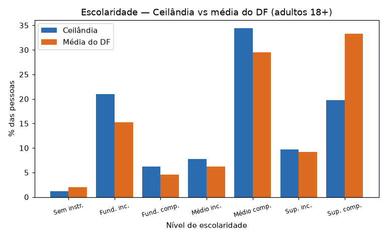
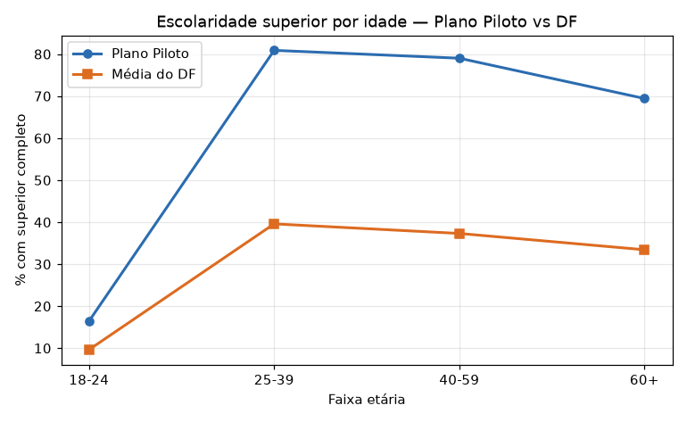
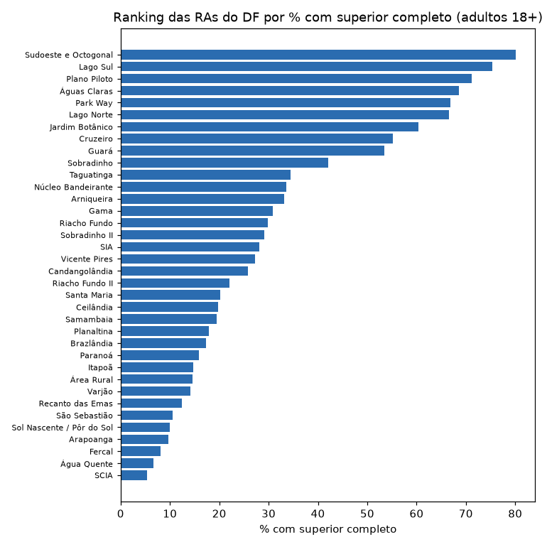

# 🎓 Trabalho Final · APC 2026/1 — Perfil Educacional por Região Administrativa (PDAD 2024)

Sistema com interface gráfica (tkinter) que permite **explorar interativamente a escolaridade
da população do Distrito Federal** a partir dos microdados da **PDAD 2024** (Pesquisa Distrital
por Amostra de Domicílios). O usuário escolhe uma Região Administrativa, uma faixa etária e o
sexo, e o sistema mostra na hora a distribuição de escolaridade, compara com a média do DF,
gera um ranking das RAs e revela como a escolaridade muda entre as gerações. Tudo isso **sem
precisar editar o código** — é só clicar. Este é o trabalho final da disciplina de Algoritmos e
Programação de Computadores (APC 2026/1 — UnB/CIC), **Recorte A**.

> **Pergunta central:** como varia o nível de escolaridade da população adulta entre as
> Regiões Administrativas do DF?

---

## 🖼️ Como são os resultados

| Distribuição por RA (vs média do DF) | Escolaridade por idade |
|---|---|
|  |  |

**Ranking das RAs por % com ensino superior completo:**



---

## 🚀 Como rodar o projeto (passo a passo)

### 1. Pré-requisitos
- **Python 3.10 ou superior** instalado ([python.org](https://www.python.org/downloads/)).
  Confira no terminal com:
  ```bash
  python --version
  ```

### 2. Baixe/clonei o projeto e entre na pasta
```bash
cd atv-final-apc
```

### 3. (Recomendado) Crie um ambiente virtual
Assim as dependências não se misturam com as do seu computador.

**Windows (PowerShell):**
```powershell
python -m venv .venv
.\.venv\Scripts\Activate.ps1
```
**Linux / macOS:**
```bash
python3 -m venv .venv
source .venv/bin/activate
```

### 4. Instale as dependências
```bash
pip install -r requirements.txt
```
> Isso instala **pandas** e **matplotlib** (o `tkinter` já vem junto com o Python).

### 5. Execute o sistema
```bash
python sistema.py
```
Vai aparecer uma barra de progresso enquanto os dados carregam e, em seguida, a janela
principal com as abas. 🎉

---

## 📂 Onde ficam os dados

O sistema procura os arquivos na pasta `dados/`, **nesta ordem**:

1. `dados/moradores.csv` — base **completa** (~69 mil moradores). É grande demais para o
   GitHub, então **não vem no repositório**. Baixe em **https://pdad.ipe.df.gov.br/**
   (base "Moradores") e coloque o arquivo em `dados/` com esse nome.
2. `dados/moradores_parcial.csv` — uma **amostra** (~4 mil moradores, todas as RAs
   representadas) que **já vem no repositório**. Serve para testar o sistema na hora, sem
   precisar baixar nada.

Ou seja: **o projeto roda imediatamente** com a amostra; se você baixar a base completa e
colocá-la em `dados/moradores.csv`, o sistema passa a usá-la automaticamente.

O dicionário oficial de variáveis (`dados/dicionario_de_variaveis_pdad_2024.xlsx`) também
está incluído, para consulta.

---

## 🧭 Como usar cada aba

- **Distribuição por RA** — escolha uma RA, uma faixa etária e o sexo. O gráfico de barras
  mostra a escolaridade daquela RA lado a lado com a **média do DF**, e os números abaixo
  trazem as estatísticas (% com superior, % com ao menos médio, % sem instrução, etc.).
  O botão **Exportar…** salva esse resumo em `.txt` ou `.csv`.
- **Comparar RAs** — escolha **duas** RAs e compare a distribuição de escolaridade delas no
  mesmo gráfico.
- **Ranking das RAs** — mostra todas as RAs do DF ordenadas por % com ensino superior
  completo, em tabela e em gráfico. A ordenação é feita **à mão** (Selection Sort).
- **Escolaridade × Idade** — gráfico de linha que mostra como o % com superior completo muda
  entre as faixas etárias — dá para ver o avanço educacional entre gerações.

Mudou um filtro? Os gráficos se atualizam sozinhos. 🔄

---

## 🔎 Decisões de análise (por que os números são confiáveis)

- **Valores sentinela** `99999` (não se aplica) e `88888` (não declarado) são **removidos**
  antes de qualquer cálculo (veja `utils/carregar.py`), como exige o enunciado.
- **Escolaridade "Sem classificação" (código 8)** é tratada como dado ausente e **não entra**
  nas estatísticas de escolaridade — ela não representa um nível de ensino, e sim pessoas
  ainda não classificáveis (em geral crianças).
- **Regiões Administrativas × municípios de Goiás:** a PDAD 2024 também amostra 12 municípios
  do entorno (GO). Como o recorte é "por Região Administrativa", o **ranking e a média do DF
  usam apenas as 36 RAs do DF**; os municípios de GO aparecem marcados com "(GO)".
- **Sexo:** usamos a variável `E03` (Masculino/Feminino), que está disponível para toda a
  amostra. A variável `id_genero` (identidade de gênero) citada no enunciado só foi coletada
  para maiores de 18 anos e é quase toda "cisgênero", sendo menos útil para este recorte.
- **Limitação conhecida:** os percentuais são contagens simples da amostra. A PDAD fornece um
  peso amostral (`peso_mor`) para estimar a população real do DF; para manter o sistema no
  nível da disciplina, **não aplicamos a ponderação** — os valores são proporções da amostra.

---

## 🗂️ Estrutura do projeto

```
atv-final-apc/
├── sistema.py              ← arquivo principal (python sistema.py)
├── utils/
│   ├── carregar.py         ← leitura do CSV, limpeza de sentinelas, rotulagem
│   ├── calcular.py         ← distribuição, estatísticas, ranking, ordenação manual
│   ├── exportar.py         ← exportação para .txt / .csv
│   └── dicionario.py       ← mapeamentos de códigos (RAs, escolaridade, sexo)
├── dados/
│   ├── moradores_parcial.csv                 ← amostra de teste (incluída)
│   ├── dicionario_de_variaveis_pdad_2024.xlsx← dicionário oficial (referência)
│   └── moradores.csv                         ← base completa (você baixa e coloca aqui)
├── imagens/                ← gráficos de exemplo usados neste README
├── requirements.txt        ← pandas, matplotlib
└── README.md
```

---

## ✅ Requisitos e diferenciais atendidos

| Requisito | Onde |
|---|---|
| 1. Janela com abas + contagem de registros | cabeçalho + `ttk.Notebook` (4 abas) |
| 2. Filtro interativo | comboboxes de RA, faixa etária e sexo |
| 3. Gráfico com matplotlib que muda com o filtro | gráfico de barras (aba 1) |
| 4. Estatísticas descritivas | painel de estatísticas (aba 1) |
| 5. Diálogo de exportação | botão **Exportar…** → `.txt`/`.csv` |
| 6. Tratamento de sentinelas | `utils/carregar.py` (`remover_sentinelas`) |
| 7. Código organizado em funções com docstrings | pacote `utils/` + funções em `sistema.py` |
| 8. README | este arquivo |

**Diferenciais implementados:**
- **D1** — segundo gráfico de tipo diferente (linha, aba "Escolaridade × Idade").
- **D2** — comparação de duas RAs lado a lado (aba "Comparar RAs").
- **D4** — ordenação implementada à mão (Selection Sort no ranking, `utils/calcular.py`).
- **D6** — barra de progresso no carregamento dos dados.

---

## 📊 Fonte dos dados

**PDAD 2024** — Pesquisa Distrital por Amostra de Domicílios, Instituto de Pesquisa e
Estatística do DF (IPEDF): **https://pdad.ipe.df.gov.br/**

---


*APC 2026/1 — Licenciatura em Computação — UnB/CIC · Prof. Jorge Henrique Cabral Fernandes*
